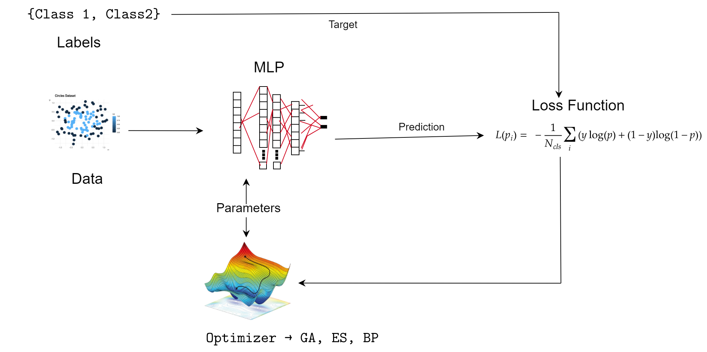

```{r setup, include=FALSE}
library(knitr)
opts_chunk$set(fig.align = "center",
               out.width = "80%",
               fig.width = 6, fig.height = 5,
               dev = "svg", fig.ext = "svg",
               par = TRUE, # needed for setting hook 
               collapse = TRUE, # collapse input & output code in chunks
               warning = FALSE)

knit_hooks$set(par = function(before, options, envir)
  { if(before && options$fig.show != "none") c
       par(family = "sans", mar=c(4.1,4.1,1.1,1.1), mgp=c(3,1,0), tcl=-0.5)
})
```

# Introduction

In this work we train a neural network, specifically a multilayer
preceptor with a single hidden layer, using two optimization methods
rarely used in neural network tuning.

 We first generated a system with which the parameters of the neural
network are tuned using a genetic algorithm and then we developed the
same procedure but using an evolutionary strategy as the optimization
method.

These two methods were used to train 3 data sets of different complexity
and their performance was compared with the traditional optimization
method used in neural networks better known as backpropagation.

For our experiments, we split each dataset into three different
partitions. A training split, with which the neural network weights are
adjusted; a validation set which allowed us to adjust the
hyperparameters used in the models; and the test set which allowed us to
provide a final evaluation of the performance of the models on a reduced
subset of the total data set.

In this notebook we show the code developed, as well as the results
obtained on each of the cells using the R programming language. Added to
this, in each section we have put our comments about our interpretation
of the behavior of the models on the data sets, trying to compare them
according to the evidence shown in the plots. 

In the first section we use the genetic algorithm on the three data
sets; in the second section we adjust the multilayer perceptron using
the evolutionary strategy algorithm; and finally we test the performance
of backpropagation as a neural network optimization method on each of
the data sets.

## Libraries

We use different libraries to develop our system. Among which we
highlight:

-   Ga -\> for the genetic algorithm

-   Nnet -\> for the neural network

-   Cmaesr -\> for the evolutionary strategy

-   Ggplot2, caTools, hrbrthemes -\> for generating plots of the results

```{r}
# Import required libraries
library(GA)
library(nnet)
library(cmaesr)
library(mlbench)
library(ggplot2)
library(caTools)
library(hrbrthemes)
```

## Split Datasets

We create a function that allows us to split the data set between
subsets. One for training, with the largest amount of data and two
secondary subsets for validation and testing respectively. This helps to
split the data efficiently and safely for the evaluation of the results.

```{r}
split_data <- function(Data, train_ratio=0.7, val_ratio=0.15, test_test=0.15){
                        samples <- sample.split(Data[[tail(names(Data), n=1)]], SplitRatio = train_ratio)
                        train  <- subset(Data, samples == TRUE)
                        valtest <- subset(Data, samples == FALSE)
                        sample2 <- sample.split(valtest[[tail(names(valtest), n=1)]], SplitRatio = val_ratio/(1-train_ratio))
                        val  <- subset(valtest, sample2 == TRUE)
                        test <- subset(valtest, sample2 == FALSE)
                        return(list('Train'=train,'Val'=val,'Test'=test))
}
```

## Plot function

Using the limit function, we can evaluate the performance of the models
in fitting the data in a practical and efficient way.  This function
allows us to visualize the predictions made by the model on a given
subset of data and to plot the decision boundaries generated by the
algorithm on the two-dimensional space over which the data live. With
these plots, it is possible to have a guide to adjust the
hyper-parameters during the model validation process, but it also allows
analyzing the behavior with the test data-set. With this function, the
points of each class, the decision line and the area encompassing the
limits of the domain corresponding to each class are drawn. 

```{r}
boundary <- function(model, data, class = NULL, predict_type = "class",
  resolution = 100, showgrid = TRUE, ...) {
  if(!is.null(class)) cl <- data[,class] else cl <- 1
  data <- data[,1:2]
  k <- length(unique(cl))

#   plot(data, col = as.integer(cl)+1L, pch = as.integer(cl)+1L, ...)
  rn <- runif(2)
  plot(data, col = rainbow(2, start = rn[1], end = rn[2])[as.integer(cl)+1L], pch = as.integer(cl)+1L, ...)

  # make grid
  r <- sapply(data, range, na.rm = TRUE)
  xs <- seq(r[1,1], r[2,1], length.out = resolution)
  ys <- seq(r[1,2], r[2,2], length.out = resolution)
  g <- cbind(rep(xs, each=resolution), rep(ys, time = resolution))
  colnames(g) <- colnames(r)
  g <- as.data.frame(g)
  
  ### guess how to get class labels from predict
  ### (unfortunately not very consistent between models)
  p <- binarize_predictions(predict(model, g)) #, type = predict_type)
  if(is.list(p)) p <- p$class
  p <- as.factor(p)

  if(showgrid) points(g, col = as.integer(p)+1L, pch = ".")

  z <- matrix(as.integer(p), nrow = resolution, byrow = TRUE)
  contour(xs, ys, z, add = TRUE, drawlabels = FALSE,
    lwd = 2, levels = (1:(k-1))+.5)

  invisible(z)
}
```

## Neural Network

For the neural network, we use the nnet library. Originally, the
functions contained in this library and the other existing ones in R
that implement these algorithms, carry out the training process
internally, which in our case is useless since the objective is to
change the optimization method used during the training of the neural
network.  To do this, using the function nn_forward created by us, we
run a single iteration of the forward step that nnet does, with this we
obtain the results of the model parameter fit to the training data by
passing them through the layers of the neural network, and subsequently
evaluate this fit with an error function appropriate for the binary
classification problem posed. The result of the loss function is used as
a metric for the genetic algorithm or evolutionary strategy to optimize
the weights that will enter the neural network in the next iteration.
This process is carried out repeatedly until the optimization algorithm
is terminated by one of the stop criteria provided. Some of the
functions such as binary cross-entropy, or binarization of the
predictions generated by the network were developed to complement this
process.

```{r}
# Create binary cross entropy
bce <- function(preds, targs){
    x <- 0
    incorr <- 0
    corr <- 0
    for (i in 1:length(preds)){
        if (preds[i] != targs[i]){incorr <- incorr +1}
        if (preds[i] == targs[i]){corr <- corr + 1}
        if (preds[i] == 0){preds[i] = 1e-7}
        if (preds[i] == 1){preds[i] = 1 - 1e-7}
        x <- x + (targs[i] * log(preds[i]+1e-7) + (1-targs[i]) * log(1-preds[i]+1e-7))
    } 
    accuracy <- corr / (incorr + corr)
    # print(incorr)
    # print(corr)
    x <- -(1/length(preds)) * x
    return(c(x, accuracy))
}
```

```{r}
# Binarize the predictions
binarize_predictions <- function(logits){
    for (i in 1:length(logits)){
        logits[i] = ifelse(logits[i]>=0.5,1,0)
    }
    return(logits)
}  
```

```{r}
# Do an epoch and get loss and accuracy of training and validation sets
nn_forward <- function(Data, formula=y ~ x1+x2+x3 , units, w, verbose=FALSE){
    
    # print("------Training")
    mlp <- nnet(formula,
                data = Data,
                size = units,
                Wts = w,
                linout = F,
                maxit=0,
                trace = F
                )
    # print('-------MLP trained')
    # Train evaluation
    predictions <- binarize_predictions(predict(mlp, Data))
    metrics <- bce(predictions, Data[[tail(names(Data), n=1)]])
    loss <- metrics[1]
    acc <- metrics[2]

    if (verbose){
      message(sprintf("Train loss: %.4f      Train acc:  %.3f: ", loss, acc))
    }
    return(loss)
}
```

## Training function for GAs, ESs, and derivation methods

This function uses all the functions already described in order to train
the three different optimization methods to be tested with each of the
datasets. It receives the hyper-parameters used by the different
algorithms and the ones they share during the adjustment process.  With
the Optimizer parameter we can choose the optimization method to be
used, either a Genetic Algorithm, an Evolution strategy, or
Backpropagation, which is the method used by the nnet function as a
basis. 

The training process is then given by the forward step performed with
the neural network, the evaluation of the fit performed with the binary
cross entropy function, and the optimization process (adjustment of
weights and bias) carried out by the GA, SE or Back-propagation.



```{r}
Training_GAESMLP <- function(formula, Data, units, optimizer, Val_data, mIters=100, earlyStopping=10, verbose=F, summary=T, plt = T, popSize = 30, searchDomain=c(-5,5), sigma = 1.5, lambda = 50, getBestWeights=FALSE){
    nWeights = ((dim(Data)[2] - 1) * units + units) + (units + 1)
    if(optimizer == 'GA') {
        print('---------- Using a Genetic Algorithm to optimize the Neural Network')
        GA <- ga(type = "real-valued", 
                 fitness =  function(w) -nn_forward(Data, formula, units, w, verbose),
                 lower = rep(searchDomain[1], nWeights), upper = rep(searchDomain[2], nWeights), 
                 popSize = popSize, maxiter = mIters, run = earlyStopping)
        w <- tail(GA@solution,n=1)
        if (summary) summary(GA)
        if (plt) plot(GA)
    } else if (optimizer == 'ES') {
        print('---------- Using a Evolutionary Strategy to optimize the Neural Network')
        obj.fn = makeSingleObjectiveFunction(name = "Evolutionary Strategy Neural Network",
                                            fn = function(w) nn_forward(Data, formula, units, w, verbose),
                                            par.set = makeNumericParamSet("w", len = nWeights, 
                                            lower = rep(searchDomain[1],nWeights), upper = rep(searchDomain[2],nWeights))
                                            )
        ES <- cmaes(obj.fn, 
                    monitor = makeSimpleMonitor(),
                    control = list(sigma = sigma, lambda = lambda, 
                                    stop.ons = c(list(stopOnMaxIters(mIters)),
                                    getDefaultStoppingConditions()))
                )
        w <- ES$best.param
    } else if (optimizer == 'BP') {
        print('---------- Using a Backpropagation to optimize the Neural Network')
        mlp <- nnet(formula,
                    data = Data,
                    size = units,
                    linout = F,
                    maxit=mIters,
                    trace = F
                    )
    }

    # # Validation evaluation
    if (optimizer != 'BP') mlp <- nnet(formula,data = Data,size = units,Wts = w,linout = F,maxit=0,trace = F)
    if (plt) {
      boundary(mlp, Data, class = tail(names(Data), n=1), main = paste('Train - Optimizer:', optimizer, sep=" ")) 
      boundary(mlp, Val_data, class = tail(names(Val_data), n=1), main = paste('Validation - Optimizer:', optimizer, sep=" "))
    }
    val_preds <- binarize_predictions(predict(mlp, Val_data))
    metrics <- bce(val_preds, Val_data[[tail(names(Val_data), n=1)]])
    val_loss <- metrics[1]
    val_acc <- metrics[2]

    if (verbose) message(sprintf("Validation loss: %.4f      Validation acc:  %.3f", val_loss, val_acc))

    if(getBestWeights && optimizer != 'BP') return(w)
    if(getBestWeights && optimizer == 'BP') return(mlp) 
    
}
```

## Testing function for GAs, ESs, and derivation methods

At the end we use a function to test the performance with the test set
for all the data sets using each of the selected models, for this we
extract from the delivery of the training process, the parameters that
resulted in the best model. These parameters are applied to the test
function to evaluate each of the existing cases in that subset and the
Decision Boundary Graph for the same is obtained.

```{r}
# Do testing of a trained model
TestBest <- function(Data, optimizer, formula=y ~ x1+x2+x3 , units, w = NULL,mlp = FALSE, verbose=FALSE){

    if (!is.null(w)) {
       mlp <- nnet(formula,
                data = Data,
                size = units,
                Wts = w,
                linout = F,
                maxit=0,
                trace = F
                )
    } 
    # print("------Training")
   
    # print('-------MLP trained')
    # Testing evaluation
    predictions <- binarize_predictions(predict(mlp, Data))
    metrics <- bce(predictions, Data[[tail(names(Data), n=1)]])
    loss <- metrics[1]
    acc <- metrics[2]

    if (verbose){
      message(sprintf("Test loss: %.4f      Test acc:  %.3f \n", loss, acc))
    }
    
    boundary(mlp, Data, class = tail(names(Data), n=1), main = paste('Test - Optimizer:', optimizer, sep=" ")) 
}
```

### Datasets

We generate synthetic data from distributions that generate example
cases and that are commonly used for testing different computational
intelligence algorithms. These data sets have different levels of
complexity with respect to the classification of the classes present in
them.  The first set, named 'classes', is characterized by two classes
distributed in a two-dimensional space that can be easily separated by a
straight line in an almost perfect way. Taking into account the level of
complexity for classification, for the second set named 'moons' it is
necessary that the algorithms can create sections with a curved decision
line in order to obtain a good classification performance between the
two classes present in this data set. Finally the set with the highest
level of complexity is named 'circles' because the points of one class
are surrounded in a circular form by the points of the opposite class
which makes the classification process difficult for the algorithms
making it impossible that with a straight line the two classes can be
divided efficiently. Below are the graphs that visually show the
behavior described above for each of the data sets.  

```{r}
circles <- read.csv(file = "circles.csv", header = FALSE)
classes <- read.csv(file = "classes.csv", header = FALSE)
moons <- read.csv(file = "moons.csv", header = FALSE)
```

```{r}
df_circles <- split_data(circles, 0.7,0.15,0.15)
df_classes <- split_data(classes,0.7,0.15,0.15)
df_moons <- split_data(moons,0.7,0.15,0.15)
```

```{r}
ggplot(circles, aes(x=V1, y=V2, color=V3)) +  
    geom_point(size=6) + 
    theme_ipsum() + ggtitle("Circles Dataset") 
ggplot(classes, aes(x=V1, y=V2, color=V3)) +  
    geom_point(size=6) + 
    theme_ipsum() + ggtitle("Classes Dataset") 
ggplot(moons, aes(x=V1, y=V2, color=V3)) +  
    geom_point(size=6) + 
    theme_ipsum() + ggtitle("Moons Dataset")
```

## Genetic Algorithm method + MLP

```{r}
# Circles dataset
circle_bestparams <- Training_GAESMLP(V3 ~ V1 + V2, df_circles$Train, 5, "GA", df_circles$Val, verbose = T, popSize = 30, getBestWeights = T) 
TestBest(df_circles$Test, 'GA', V3 ~ V1+V2, 5, w=circle_bestparams, verbose = T)
```

```{r}
# Moons dataset
moons_bestparams <- Training_GAESMLP(V3 ~ V1 + V2, df_moons$Train, 5, "GA", df_moons$Val, verbose = T, popSize = 30, getBestWeights = T) 
TestBest(df_moons$Test, 'GA', V3 ~ V1+V2, 5, w=moons_bestparams, verbose = T)
```

```{r}
# Classes dataset
classes_bestparams <- Training_GAESMLP(V3 ~ V1 + V2, df_classes$Train, 5, "GA", df_classes$Val, verbose = T, popSize = 30, getBestWeights = T) 
TestBest(df_classes$Test, 'GA', V3 ~ V1+V2, 5, w=classes_bestparams, verbose = T)
```

**Analysis of the results obtained with the genetic algorithm method**

Circles dataset: With this data set the genetic algorithm was able to
perform a good training, obtaining a good performance in the training
set. For the validation set, the accuracy decreased a little, however
the results on the test set, even with little data, managed to make an
acceptable adjustment obtaining an accuracy in the middle between that
obtained for training and validation.

Moons dataset:  For the set of moons, the results obtained by the
genetic algorithm were better than those obtained for the set of
circles. This is an expected behavior, as this is a less complex set to
classify. The accuracy value obtained for the validation data is higher
than that obtained for the training data and in the case of the test set
the accuracy value is very similar to the training value which indicates
that in this case the model has an acceptable generalization capacity.

Classes dataset: For the simplest case, the results obtained by the
genetic algorithm as an optimization method are consistent, obtaining a
good performance, with very similar accuracy values for training,
validation and testing. However, according to the results seen for the
set of moons, the results for this set are a little lower.

## Evolution Strategy + MLP

```{r}
# Circles dataset
circle_bestparams <- Training_GAESMLP(V3 ~ V1 + V2, df_circles$Train, 5, "ES", df_circles$Val, verbose = T,sigma = 1.5, lambda = 50, getBestWeights = T)
TestBest(df_circles$Test, 'ES', V3 ~ V1+V2, 5, w=circle_bestparams, verbose = T)
```

```{r}
# Moons dataset
moons_bestparams <- Training_GAESMLP(V3 ~ V1 + V2, df_moons$Train, 5, "ES", df_moons$Val, verbose = T,sigma = 1.5, lambda = 50, getBestWeights = T)
TestBest(df_moons$Test, 'ES', V3 ~ V1+V2, 5, w=moons_bestparams, verbose = T)
```

```{r}
# Classes dataset
classes_bestparams <- Training_GAESMLP(V3 ~ V1 + V2, df_classes$Train, 5, "ES", df_classes$Val, verbose = T,sigma = 1.5, lambda = 50, getBestWeights = T)
TestBest(df_classes$Test, 'ES', V3 ~ V1+V2, 5, w=classes_bestparams, verbose = T)
```

**Analysis of the results obtained with the Evolution Strategy method**

Circles dataset: With this second method used, the accuracy obtained on
this dataset improved. We can see that the evolutionary strategy model
had a much higher value in training than the one obtained with the
genetic algorithm, however this does not affect the validation stage,
since an accuracy value with similar magnitudes is also obtained. With
the test set, a lower accuracy value was obtained, which indicates some
deficiency in the generalization of the data. 

Moons dataset:  For this data set, the results obtained using the
evolutionary strategy algorithm indicate an almost perfect fit to the
training data.  This is evident when analyzing the validation data and
the test data obtaining in the latter a result of 100% correctly
classified.  This is an indication that with both the set of circles and
the set of moons the evolutionary strategy algorithm outperforms the
genetic algorithm.  However these results have to be evaluated with
caution as the data used in the test set may not be large enough to
generate meaningful conclusions across large data sets. 

Classes dataset: Contrary to what we might have expected previously for
the simplest set, the evolutionary strategy algorithm performed
similarly to that obtained using the genetic algorithm. In this case we
can see that the accuracy values during training are quite high, however
they decrease for the validation set and for the test set. This may
indicate some overfitting of the model, which can be corrected by using
some regularization strategies on the models.

## Back-propagation + MLP

```{r}
# Circles dataset
circle_bestparams <- Training_GAESMLP(V3 ~ V1 + V2, df_circles$Train, 5, "BP", df_circles$Val, verbose = T, getBestWeights = T)
TestBest(df_circles$Test, 'BP', V3 ~ V1+V2, 5, mlp=circle_bestparams, verbose = T)
```

```{r}
# Moons dataset
moons_bestparams <- Training_GAESMLP(V3 ~ V1 + V2, df_moons$Train, 5, "BP", df_moons$Val, verbose = T, getBestWeights = T)
TestBest(df_moons$Test, 'BP', V3 ~ V1+V2, 5, mlp=moons_bestparams, verbose = T)
```

```{r}
# Classes dataset
classes_bestparams <- Training_GAESMLP(V3 ~ V1 + V2, df_classes$Train, 5, "BP", df_classes$Val, verbose = T, getBestWeights = T)
TestBest(df_classes$Test, 'BP', V3 ~ V1+V2, 5, mlp=classes_bestparams, verbose = T)
```

**Analysis of the results obtained with the backpropagation method**

Circles dataset: Due to limitations in the implementation of the nnet
function, the accuracy and loss data during the training for the neural
network adjustment using the backpropagation algorithm as optimizer are
not shown in the code execution.  However, the results for the
validation and test set are shown, as well as the decision line plots
generated. What we observe is that the backpropagation algorithm does a
very good job, fitting the training, validation and test data. 
Specifically, the plots show that this fit is much more sensible,
encompassing the data in all three cases in a circular area just as the
name of the data set indicates it should be. 

Moons dataset:  As expected by the backpropagation algorithm, the model
fits the data very well and generalizes to the validation and test sets
according to the results shown for this dataset. The generated plots
show how the behavior of the data across the training, validation and
test sets are consistent. It can be seen how the decision line generated
by the model is also consistent, fitting almost perfectly to the data
contained in each of the subsets. In this case the training, validation
and test values for loss and accuracy are very similar, which
demonstrates the clear strength of this algorithm to fit the neural
networks to the data.

Classes dataset: Finally, the propagation algorithm does as expected
with the set of 'Classes'. It can be seen that it splits the data of
both classes with an almost straight line, only adjusting at the bottom
of the plot with a small curve that it needs to be able to section the
data correctly.  However, the results on the validation set are a bit
lower. This could indicate a lower performance on this subset, but,
looking at the decision line drawn by the model, we can see that it is
actually trying to generalize a bit more over the data shown in this
set.

# Conclusions

Throughout this work, different experiments were carried out to fit
synthetic data of different levels of complexity using the well-known
neural networks.  Although the traditional algorithms for the
optimization of this type of models are derivative algorithms, it is
possible to use other optimization methods for the adjustment of these
models. Testing the different data sets used we can conclude that the
backpropagation algorithm has a very good performance in this task.
However the evolutionary strategy used also manages to adjust in a great
way the models generated by this method to the different data sets. On
the other hand, although with a slightly lower performance than the
other two methods used, the genetic algorithm also manages to provide an
acceptable performance in the generation of models for the data sets
used.  The results shown in this work can be improved through a more
extensive experimentation using cross-validation methods for the
adjustment of the hyperparameters of each of the methods used. It is
also possible to run experiments on larger data sets and even data from
problems that come from a real environment and see the performance of
these models in a more complete way. The results obtained in this work
show that there are other optimization methods capable of adjusting
predictive models efficiently and with which good results are obtained.
